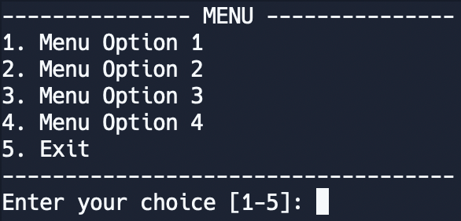

# Unit 5 Chapter 2 Question 1 - Menu UI

**Objective:** You will create a program that converts from scientific units to freedom units using a fancy console menu UI.

## Menu Options

Each of the below menu options are the conversion options that each must be a separate function. They are for one way conversions only. The user will be prompted to enter a number and the program will convert the number to the other unit. The program will then print the result to the console.

1. Meters to Feet
2. Kilgram to Pounds
3. Celsius to Fahrenheit
4. Kilometers per hour to Miles per hour

Remember, there are no parameters or return values in these functions. The function will ask the user for input, convert the input, and print the result.

## Menu User Interface

Next, create a menu function that will display the menu options to the user. The menu should be a loop that continues until the user chooses to exit. Inside the function, make sure to:

- Print the menu options to the console in a fancy design
- Ask the user to enter a number corresponding to the menu option they want to choose
- Call the appropriate conversion function based on the user's choice
- Have an exit option that will break the loop
- Do not call this menu function within itself, avoid recursion. Use a loop instead. 

Below is a sample menu design. You must design your own menu. 



## Main Function

Finally, create a main function that will call the menu function. This is where your program will start executing. You can use the code snippet below to get started. 

```python
do_stuff  # All your code above


def main():
    menu()  # Runs your program in the correct order


if __name__ == '__main__':
    main()

```

## Optional Practice

Build docstrings for each of your functions. Docstrings are a way to document your code and explain what each function does. They are also used by IDEs to provide hints and suggestions when you are writing code.
You can use the code snippet below to get started. 

```python
def greet():
    """
    Greet the user.
    """
    print("Hello, welcome to the program!")
    
```
